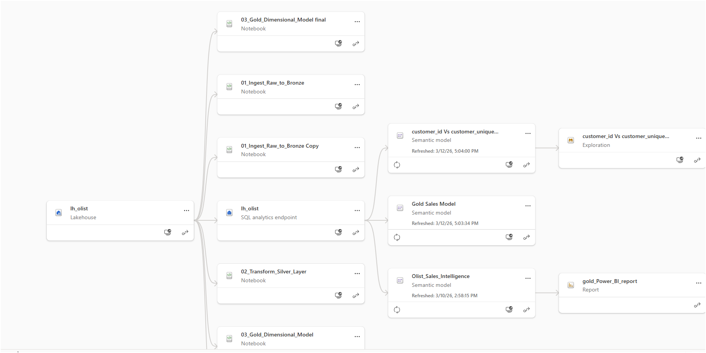
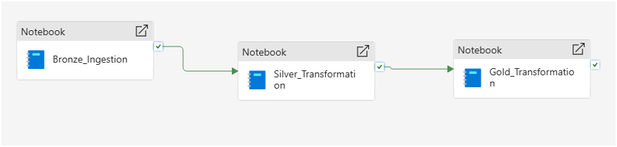

# microsoft_fabric_olist_saas_project

## 📌 Project Overview
This project demonstrates an enterprise-grade data engineering and analytics pipeline built entirely within **Microsoft Fabric**. It ingests raw e-commerce data (Olist dataset) and processes it through a **Medallion Architecture** (Bronze, Silver, Gold) using PySpark. The final output is a highly optimized Star Schema connected to Power BI via zero-latency DirectLake mode.

## 🏗️ Architecture & Technologies
* **Platform:** Microsoft Fabric (OneLake, Lakehouse, SQL Analytics Endpoint)
* **Data Engineering:** PySpark, Apache Spark, Delta Lake format
* **Data Modeling:** Dimensional Modeling (Star Schema)
* **Business Intelligence:** Power BI (DirectLake connectivity), DAX

## ⚙️ Data Pipeline Execution (The Medallion Architecture)

### 🥉 Bronze Layer: Raw Data Ingestion
* **File:** `01_Ingest_Raw_to_Bronze.ipynb`
* Ingested raw Olist E-commerce CSV files into OneLake.
* Maintained raw fidelity for historical auditing and lineage.

### 🥈 Silver Layer: Cleansing & Conforming
* **File:** `02_Transform_Silver_Layer.ipynb`
* **PySpark Transformations:** Applied schema enforcement, standardized data types, and cast string dates to proper timestamps.
* **Data Quality:** Handled missing values and standardized naming conventions (e.g., `silver_customers`).
* **Storage:** Saved cleaned datasets as optimized Delta Parquet tables.

### 🥇 Gold Layer: Semantic Modeling (Star Schema)
* **File:** `03_Gold_Dimensional_Model final.ipynb`
* **Dimensional Modeling:** Engineered a robust Star Schema optimized for downstream analytical performance.
* **Entity Resolution:** Resolved complex primary key relationships and eliminated dimensional duplicates to ensure data integrity.
* **Final Assets:** Produced clean, aggregated Delta tables: `fact_sales`, `dim_customers`, `dim_products`, and `dim_sellers`.

## 📊 Visual Proof & BI Integration

## 📊 Project Visuals

### End-to-End Process Flow

### Microsoft Fabric Data Pipeline

### Power BI Executive Report

* **DirectLake Mode:** Leveraged native connectivity to eliminate data import latency, allowing Power BI to query Delta files directly from OneLake.
* **Business Logic:** Authored DAX measures to calculate core business KPIs, including Total Revenue and Total Orders.

--
